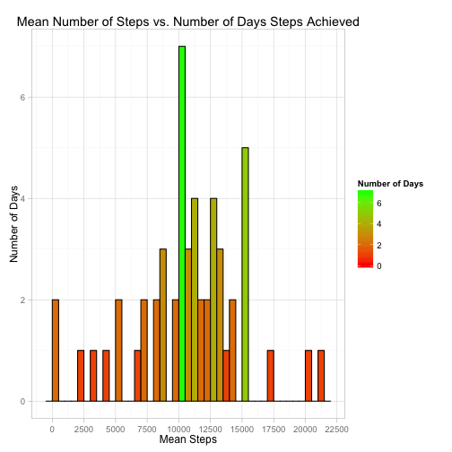
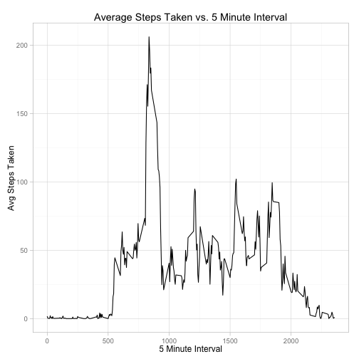
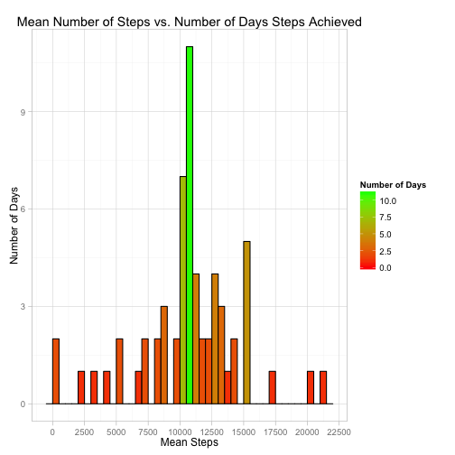
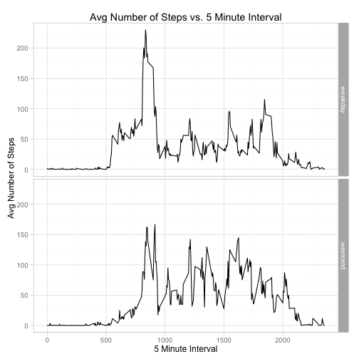

## Loading and preprocessing the data

```r
## check if data is downloaded, if not download
if (!file.exists("./activity.zip")) {
        ## download the Activity Data file.
        fileURL <- "https://github.com/tnt16dj/RepData_PeerAssessment1/blob/master/activity.zip?raw=true"
        download.file(fileURL,destfile="./activity.zip",method="curl")
        ## unzip the file
        unzip("activity.zip")
}

## check if the file has already been unzipped
if (!file.exists("activity.csv")){
        ## unzip the file
        unzip("./activity.zip")
}

## load activityData data frame
activityData <- read.csv("./activity.csv")
```


## What is mean total number of steps taken per day?

First, calculate the total number of steps per date using the aggregate function.  We will ignore NA values in this instance as directed by the assignment.

```r
## calculate the total number of steps for each date.
totStepsByDay <- aggregate(steps ~ date,
                           data=activityData,
                           FUN="sum",na.action=na.pass)

## plot the graph.
library(ggplot2)
library(grid)
g <- ggplot(totStepsByDay,aes(x=steps), height=600, width=800)
g <- g + geom_histogram(aes(fill=..count..),binwidth=500,colour="black") 
g <- g + scale_fill_gradient("Number of Days",low="red",high="green")
g <- g + xlab("Mean Steps") + ylab("Number of Days")
g <- g + ggtitle("Mean Number of Steps vs. Number of Days Steps Achieved")
g <- g + scale_x_continuous(breaks=seq(0,25000,by=2500))
g <- g + theme_light()
print(g)
```

 


The mean total number of steps taken on any given day is:

```r
mean(totStepsByDay$steps,na.rm=TRUE)
```

```
## [1] 10766
```


The median total number of steps taken on any given day is:

```r
median(totStepsByDay$steps,na.rm=TRUE)
```

```
## [1] 10765
```


## What is the average daily activity pattern?

First, calculate the average steps by interval across the whole dataset.  Again, we ignore NA steps values as directed by the assignment.

```r
## calculate average steps by interval.
avgStepsByInterval <- aggregate(x = list(steps = activityData$steps), 
                      by = list(interval = activityData$interval), 
                      FUN = mean, na.rm = TRUE)

## plot the graph.
g <- ggplot(data=avgStepsByInterval,aes(x=interval,y=steps), height=600, width=800)
g <- g + geom_line()
g <- g + xlab("5 Minute Interval") + ylab("Avg Steps Taken")
g <- g + ggtitle("Average Steps Taken vs. 5 Minute Interval")
g <- g + theme_light()
print(g)
```

 


The 5 Minute Interval which experiences the most steps on average is:

```r
avgStepsByInterval[which.max(avgStepsByInterval$steps),]
```

```
##     interval steps
## 104      835 206.2
```


## Imputing missing values
The total number of missing values in the dataset is:

```r
nrow(activityData[is.na(activityData$steps),])
```

```
## [1] 2304
```


Here we replace missing step values with the average for the given interval:

```r
activityDataCleaned <- 
        transform(activityData, 
                steps = ifelse(is.na(activityData$steps), 
                               avgStepsByInterval$steps[match(activityData$interval, avgStepsByInterval$interval)], 
                               activityData$steps))
```


Here is the new histogram plot after replacing NA step data with the average for the given interval:

```r
## calculate the total steps per date.
totStepsByDayCleaned <- aggregate(steps ~ date,
                                  data=activityDataCleaned,
                                  FUN="sum",na.action=na.pass)

## plot the graph.
g <- ggplot(totStepsByDayCleaned,aes(x=steps), height=600, width=800)
g <- g + geom_histogram(aes(fill=..count..),binwidth=500,colour="black") 
g <- g + scale_fill_gradient("Number of Days",low="red",high="green")
g <- g + xlab("Mean Steps") + ylab("Number of Days")
g <- g + ggtitle("Mean Number of Steps vs. Number of Days Steps Achieved")
g <- g + scale_x_continuous(breaks=seq(0,25000,by=2500))
g <- g + theme_light()
print(g)
```

 


And for reference, here is the histogram for the un-imputed dataset:

```r
g <- ggplot(totStepsByDay,aes(x=steps), height=600, width=800)
g <- g + geom_histogram(aes(fill=..count..),binwidth=500,colour="black") 
g <- g + scale_fill_gradient("Number of Days",low="red",high="green")
g <- g + xlab("Mean Steps") + ylab("Number of Days")
g <- g + ggtitle("Mean Number of Steps vs. Number of Days Steps Achieved")
g <- g + scale_x_continuous(breaks=seq(0,25000,by=2500))
g <- g + theme_light()
print(g)
```

 


The mean total number of steps taken on any given day using the imputed dataset is:

```r
mean(totStepsByDayCleaned$steps)
```

```
## [1] 10766
```


The median total number of steps taken on any given day using the imputed dataset is:

```r
median(totStepsByDayCleaned$steps)
```

```
## [1] 10766
```


As you can see, the mean and median are unaffected between the non-imputed and imputed data sets.  

The impact to the total number of steps when imputing values on the data set is:

```r
sum(totStepsByDayCleaned$steps) - sum(totStepsByDay$steps,na.rm=TRUE)
```

```
## [1] 86130
```

Overall, imputing the data significantly increased the overall number of steps.  However, data imputation does not impact the mean and median calculations on the given data set.


## Are there differences in activity patterns between weekdays and weekends?
Now, we create a variable, "weekdays" identifying the day value (Monday, Tuesday, etc...) for each date:

```r
activityDataCleaned$weekdays <- weekdays(as.Date(activityDataCleaned$date))
```

Then, convert the weekday variable to a factor specificying "weekday" or "weekend":

```r
activityDataCleaned$weekdays <- 
        as.factor(ifelse(activityDataCleaned$weekdays %in% c("Saturday", "Sunday"),
                         "weekend", 
                         "weekday"))
```

Finally we plot the Average Number of Steps vs each 5 Minute Interval split by Weekday or Weekend:

```r
## average the cleaned step data by interval and weekdays
avgStepsByIntervalCleaned <- aggregate(steps ~ interval + weekdays, data=activityDataCleaned, mean)

## build the plot
g <- ggplot(avgStepsByIntervalCleaned,aes(interval,steps))
g <- g + geom_line()
g <- g + facet_grid(weekdays ~ .)
g <- g + xlab("5 Minute Interval") + ylab("Avg Number of Steps")
g <- g + ggtitle("Avg Number of Steps vs. 5 Minute Interval")
g <- g + theme_light()
print(g)
```

 
